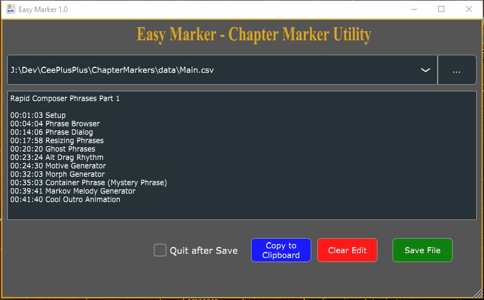
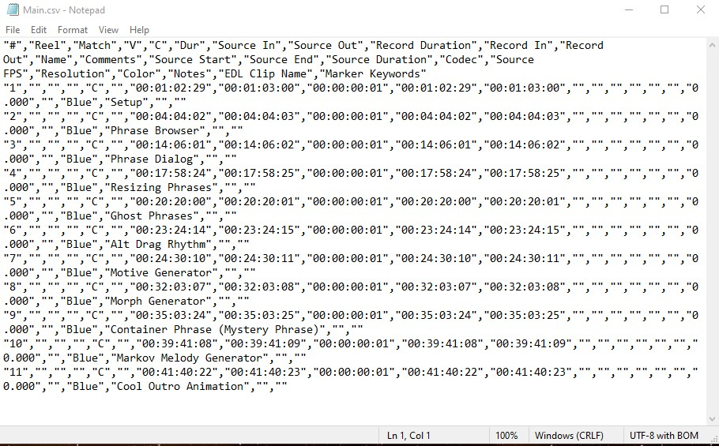

# Easy-CSV-Marker-Utility-CMU-
A utility to create chapter markers from CSV files.  Uses JUCE graphics API.

It's important that you see the readme.md file in the repo.  To compile this 
project, you have make a *small* modification to the JUCE core library.

