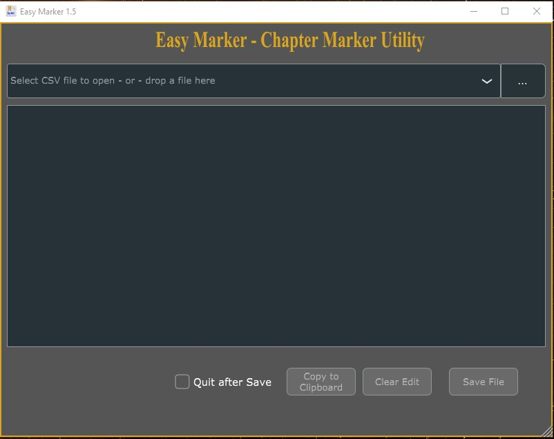
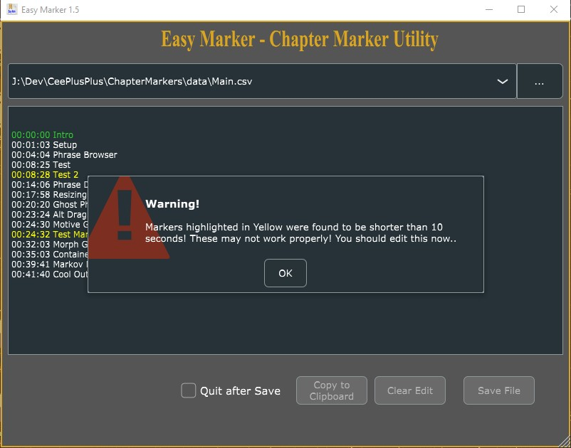

# Easy-CSV-Marker-Utility-CMU-
A utility to create YouTube freindly chapter markers from DaVinci Resolve CSV files.  Uses JUCE graphics API.

#### Enforces YouTube Marker "Conditions"
* Must Have 00:00 Intro
* Must Have minimum 3 Markers
* Marker time stamps must be greater than 10 secs between markers

It's important that you see the SetUp.md file in the repo.  To compile this 
project, you have make a *small* modification to the JUCE core library.

#### Example CSV

#### Easy Marker

#### YouTube Ready Chapter Markers

#### Enforces the "10 Second" condition

